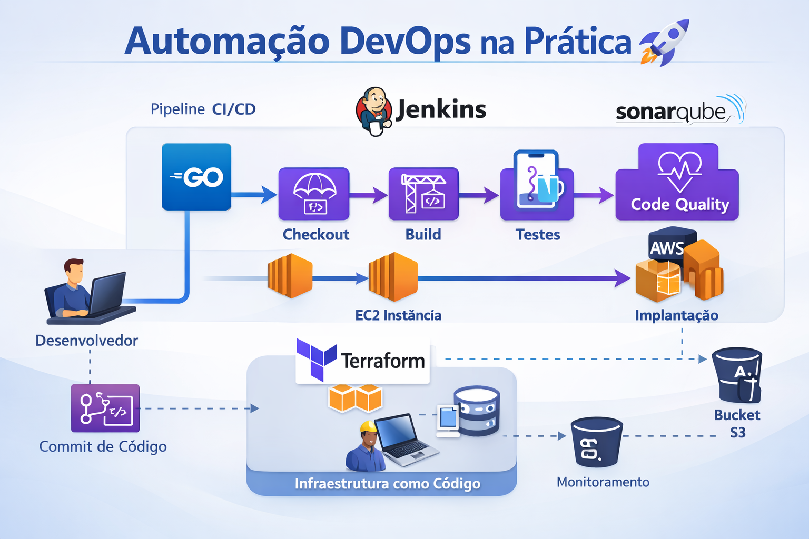
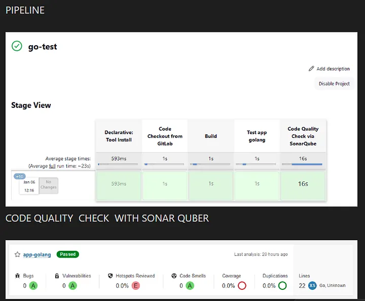

# jenkins_pipeline_with_sonarqube_and_gitlab_in_aws
Criação de um pipeline completo com Jenkins, SonarQube e GitLab na AWS usando Terraform, pensado para um projeto em Go (Golang).

<p align="center">
	
</p>

<p align="center">
  
</p>

Resumo
------
Projeto demonstrando automação DevOps na AWS com infraestrutura provisionada por Terraform e integração CI/CD via Jenkins, análise de qualidade com SonarQube e repositório de código GitLab.

Estrutura e documentação
------------------------
- `modules/` — código Terraform modular (EC2, VPC, key pair)
- `data/` — scripts de provisionamento (user-data)
- `img/` — evidências e screenshots (opcional)
- `terraform.tfvars.example` — exemplo de variáveis
- `outputs.tf` — outputs principais
- `.github/workflows/terraform.yml` — validações de IaC (fmt/validate/tflint)

Nota: esta pipeline é voltada a um projeto em Go (Golang). O tutorial detalhado (com passos e prints) está disponível no Medium: https://medium.com/@peacevan/pipeline-ci-cd-com-terraform-aws-jenkins-sonarquber-gitlab-golang-c9f1b79ae379

Documentação detalhada (moved):
- Plano de melhorias: [docs/PLANO_DE_MELHORIA.md](docs/PLANO_DE_MELHORIA.md)
- Passo-a-passo e instalação: [docs/STEP_BY_STEP.md](docs/STEP_BY_STEP.md)
- Resumo rápido: [docs/RESUMO.md](docs/RESUMO.md)
- Plano do pipeline: [docs/PIPELINE_PLAN.md](docs/PIPELINE_PLAN.md)

Quickstart
----------
1. Instalar Terraform 1.5.x e configurar AWS CLI/credenciais.
2. Instalar o toolchain Go (recomendado Go 1.20+), caso queira compilar/testar a aplicação exemplo.
2. Copiar e ajustar `terraform.tfvars.example` → `terraform.tfvars` com valores reais (não comitar `*.tfvars`).
3. Validar:

```bash
terraform init
terraform fmt
terraform validate
```

Segurança
--------
- `allowed_cidrs` defaulta para `["0.0.0.0/0"]` apenas para laboratório. Ajuste antes de produção.
- Não exponha chaves ou credenciais em commits públicos.

Próximos passos sugeridos
------------------------
- Executar `terraform fmt` + `terraform validate` em CI (já adicionado) e localmente.
- Adicionar diagrama em `img/` e evidências de pipeline.
- Revisar `allowed_cidrs` e mover segredos para SSM/Secrets Manager.

Contribuição
------------
Abra PRs na branch `main` a partir de `improve/*` para mudanças maiores. Use o arquivo `pr_body.md` como modelo para PRs.
